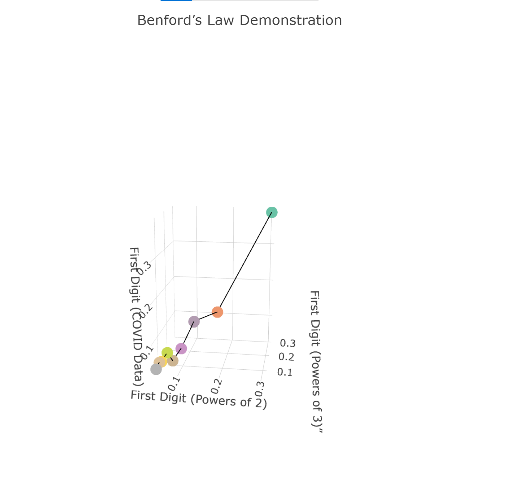

1.  

```{r}
library(magrittr) 
library(dplyr)
library(ggplot2)
library(plotly)
```

```{r}
set.seed(12)
xDF1 <- runif(100)  #how to simulate data before $>%
runif(100) %>% data.frame(y = 2*. + rnorm(100) + 9 , x=.)%>% ggplot(aes(x, y)) + geom_point() + geom_smooth(method='lm')
```

2.  


(1) 

```{r}
NOBEL   <- read.table(url("https://raw.githubusercontent.com/dsy109/Supplemental/main/Courses/705/nobel.txt"),header = TRUE)
```

The output of the structure of the Nobel Prize:

```{r}
typeof(NOBEL)
```

Here the four variables has the following:

```{r}
class(NOBEL$prize_year)
```

```{r}
class(NOBEL$category)
```

```{r}
typeof(NOBEL$gender)
```

```{r}
typeof(NOBEL$age)
```

(2) For the missing age:

```{r}
NOBEL$category <- as.factor(NOBEL$category)
```

```{r}
table(NOBEL$category[which(is.na(NOBEL$age))])
```

For the missing gender:

```{r}
table(NOBEL$category[which(is.na(NOBEL$gender))])
```

The Peace has the most missing values for each of these variables.

(3) 


```{r}
ggplot(NOBEL, aes(x=age)) + geom_histogram(aes(y=..density..)) +   geom_density(color="red")
```

I think the distribution of ages is a like a normal distribution with mean around 58. Although has a little bit left skewed, but basically show a normal distribution.

```{r}
ggplot(NOBEL, aes(x=age)) +
  geom_histogram(aes(y=..density..)) +
   facet_wrap(vars(category)) +
  geom_density(color="red")
```

Here I noticed that the winner's age of the Chemistry, Medicine and Physics shows a slightly right skewed normal distribution which centered around 50. For the winner's age of Economics, although it also shows a slightly right skewed normal distribution, its mean is larger than the previous three categories, with a larger variance. The distribution of winner's age of the peace, shows a left skewed distribution which centered around 55. The winner's age of Literature shows a double peak distribution which centered at 58.

(4) 

```{r}
base_size <- 11
ggplot(NOBEL, aes(x=prize_year,y =age  )) +
  geom_point(aes(colour=gender)) +
   facet_wrap(vars(category)) +
   geom_smooth(method = loess)+
   theme_bw(base_size = 11,
  base_line_size = base_size/22,
  base_rect_size = base_size/22
)
```

From the gender part, I notice that the men were the majority of the winners.

For the Chemistry, Medicine, Physics and Literature nobel prize, with the passage of time, the winner's age is increasing. On the other hand, the winner of peace's age is decreasing. Economic prize winner's age shows fluctuate among different years.

3.  

```{r}
COVID   <- read.csv(url("https://raw.githubusercontent.com/dsy109/Supplemental/main/Courses/705/COVID.txt"), sep = "\t")
```

(1) 

```{r}
first.digit  <- function(x) { 
                a <- trunc(log10(x))+1
                
                return(trunc(x/10^(a-1)))
                 
}
```

(2) 

```{r}
power_32 <- 2^seq(1:1000)
mytable <- table(sapply(power_32, function(x) {
  first.digit(x)}))
```

```{r}
mytable/1000
```

(3) 

```{r}
power_33 <- 3^seq(1:500)
mytable3 <- table(sapply(power_33, function(x) {
  first.digit(x)}))
```

```{r}
mytable3/500
```

(4) 

```{r}
my_covid <- COVID$Deaths
```

```{r}
mytable4 <- table(sapply(my_covid, function(x) {
  first.digit(x)}))
```

```{r}
mytable4/192
```

(5) 

```{r}
my_df5 <- data.frame(
  Leading_Digit = 1:9,
  two_power = mytable/1000,
  three_power = mytable3/500,
  Prop_COVID = mytable4/192
)
```

```{r}
my_df5$two_power.Var1 <- NULL

my_df5$three_power.Var1 <- NULL
my_df5$Prop_COVID.Var1 <- NULL

```

```{r}
my_df5$three_power.Freq
```

```{r}
summary(lm(Prop_COVID.Freq~two_power.Freq + three_power.Freq ,data = my_df5))
```

Here the $R^2$ is 0.953. The adjusted $R^2$ is 0.9373.

(5) 

```{r}
p <- plot_ly(
  x = my_df5$two_power.Freq,
  y = my_df5$three_power.Freq ,
  z = my_df5$Prop_COVID.Freq,
  type = 'scatter3d' ,
  mode='lines',
  line = list(color = 'black')
)  %>% add_markers( data = my_df5,  color =  ~factor( Leading_Digit), mode = 'markers' ) %>% 
  layout( title ='Benford’s Law Demonstration',scene = list(xaxis = list(title = 'First Digit (Powers of 2)'),
     yaxis = list(title = 'First Digit (Powers of 3)”'),  zaxis = list(title = 'First Digit (COVID Data)')                      
                                                            ))
```


```{r}

```

4.  

```{r}
library(HoRM)
```

```{r}
data("tortoise")
```


Linear regression line:
```{r}
ggplot(tortoise,aes(length,clutch)) +
  geom_point() +
  geom_smooth(method='lm') 
```

```{r}
ggplot(tortoise,aes(length,clutch)) +
  geom_point() +
  geom_smooth(method = "lm", formula = y ~ x + I(x^2))
```

```{r}
ggplot(tortoise,aes(length,clutch)) +
  geom_point() +
  geom_smooth(method = "lm", formula = y ~ x + I(x^2)+I(x^3))
```
Here I get that the above 3 regression. Here I noticed that the curve model is better than the 
linear model. However, I did not see a lot of difference between the quadratic and cubic model.

(b)
ANOVA:
```{r}
my_1 <-  lm(clutch ~  length,data = tortoise)
my_2 <-  lm(clutch ~ length + I(length^2),data = tortoise)
my_3 <-  lm(clutch ~ length + I(length^2)+I(length^3),data = tortoise)
```

```{r}
anova(my_1,my_2)
```


```{r}
anova(my_3,my_2)
```
```{r}
anova(my_1,my_3)
```
Stepwise variable selection using AIC:
```{r}
step(my_3)
```
Calculating the BIC
```{r}
step(my_3,k=log(length(tortoise$length)))
```

Here I choose 3 different ways to select the best model. Anova ,AIC and BIC. For the Anova, it agree with your assessment in the previous part. However, the AIC and BIC model agree with curve model is better than the linear model, but the AIC and BIC procudure said that the quadratic model is enough and cubic term is required.


